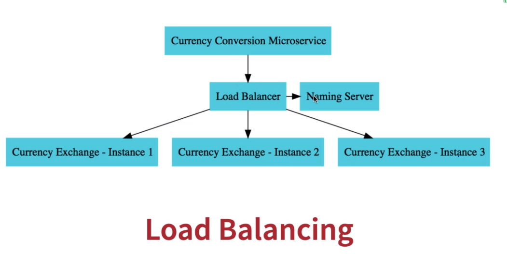
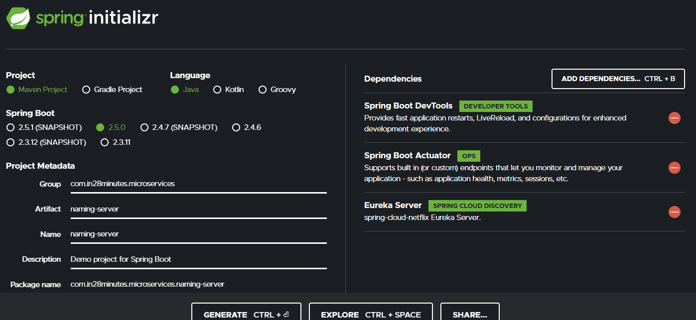

# URL and Response Structure for Currency Conversion Service
We will make use of these in the next lecture!

URL
http://localhost:8100/currency-conversion/from/USD/to/INR/quantity/10


```
Response Structure
{
    "id": 10001,
    "from": "USD",
    "to": "INR",
    "conversionMultiple": 65.00,
    "quantity": 10,
    "totalCalculatedAmount": 650.00,
    "environment": "8000 instance-id"
}
```


# Dynamic Selecting Microservices from Naming Server Registry - EUREKA


## Refer Naming Server Application
