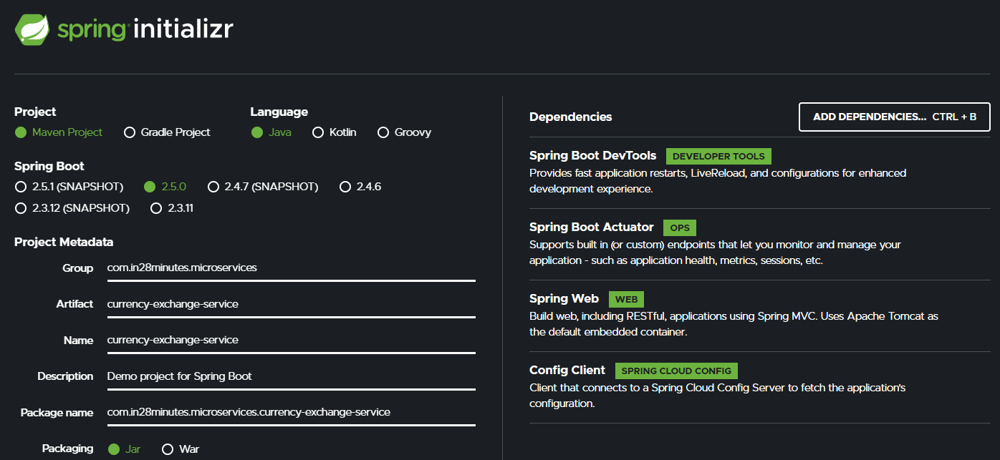

# Dependencies to Add

# Check Following links
https://github.com/in28minutes/spring-microservices-v2/blob/main/03.microservices/01-step-by-step-changes/microservices-v2-1.md#spring-cloud-config-server---steps-01-to-08

## URL and Response Structure for Currency Exchange Service
### We will make use of these in the next lecture!

## URL & Response for Currency Exchange Service
URL : http://localhost:8000/currency-exchange/from/USD/to/INR

``
Response Structure
{
"id":10001,
"from":"USD",
"to":"INR",
"conversionMultiple":65.00,
"environment":"8000 instance-id"
}
``
## URL & Response for Currency Conversion Service
URL : http://localhost:8100/currency-conversion/from/USD/to/INR/quantity/10