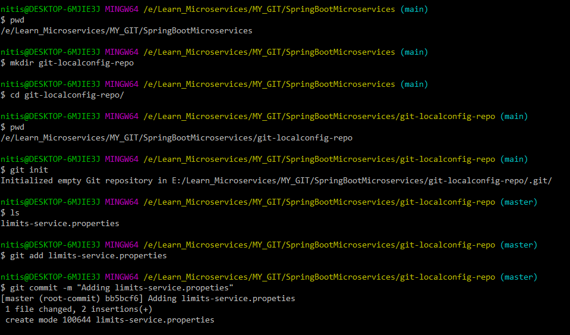

# **Spring Boot - Centralized (Spring Cloud Server) Configuration Example**

## Step 1 : To create configurations in GIT Repository

nitis@DESKTOP-6MJIE3J MINGW64 /e/Learn_Microservices/MY_GIT/SpringBootMicroservices (main)
$ git --version
git version 2.31.1.windows.1

nitis@DESKTOP-6MJIE3J MINGW64 /e/Learn_Microservices/MY_GIT/SpringBootMicroservices (main)
$ pwd
/e/Learn_Microservices/MY_GIT/SpringBootMicroservices

nitis@DESKTOP-6MJIE3J MINGW64 /e/Learn_Microservices/MY_GIT/SpringBootMicroservices (main)
$ mkdir git-localconfig-repo

nitis@DESKTOP-6MJIE3J MINGW64 /e/Learn_Microservices/MY_GIT/SpringBootMicroservices (main)
$ cd git-localconfig-repo/

nitis@DESKTOP-6MJIE3J MINGW64 /e/Learn_Microservices/MY_GIT/SpringBootMicroservices/git-localconfig-repo (main)
$ pwd
/e/Learn_Microservices/MY_GIT/SpringBootMicroservices/git-localconfig-repo

nitis@DESKTOP-6MJIE3J MINGW64 /e/Learn_Microservices/MY_GIT/SpringBootMicroservices/git-localconfig-repo (main)
$ git init
Initialized empty Git repository in E:/Learn_Microservices/MY_GIT/SpringBootMicroservices/git-localconfig-repo/.git/

nitis@DESKTOP-6MJIE3J MINGW64 /e/Learn_Microservices/MY_GIT/SpringBootMicroservices/git-localconfig-repo (master)
$ ls
limits-service.properties

nitis@DESKTOP-6MJIE3J MINGW64 /e/Learn_Microservices/MY_GIT/SpringBootMicroservices/git-localconfig-repo (master)
$ git add limits-service.properties

nitis@DESKTOP-6MJIE3J MINGW64 /e/Learn_Microservices/MY_GIT/SpringBootMicroservices/git-localconfig-repo (master)
$ git commit -m "Adding limits-service.propeties"
[master (root-commit) bb5bcf6] Adding limits-service.propeties
1 file changed, 2 insertions(+)
create mode 100644 limits-service.properties

